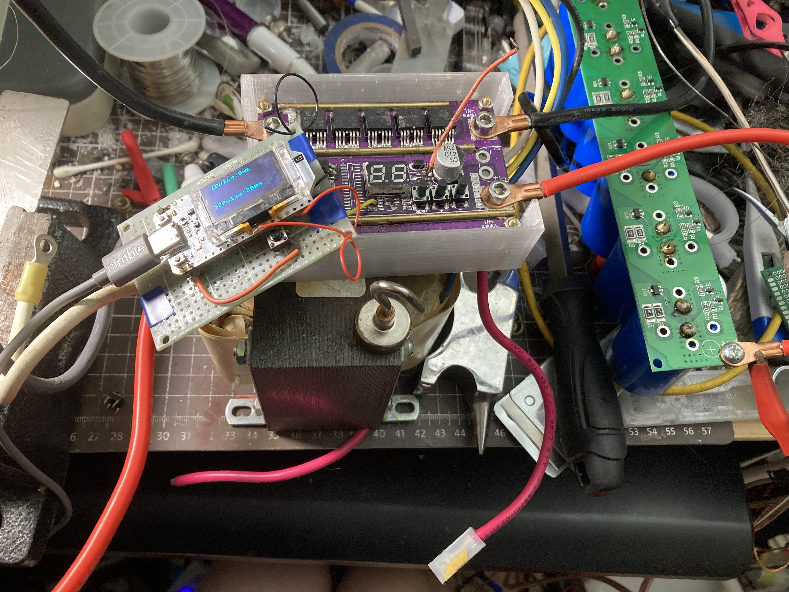
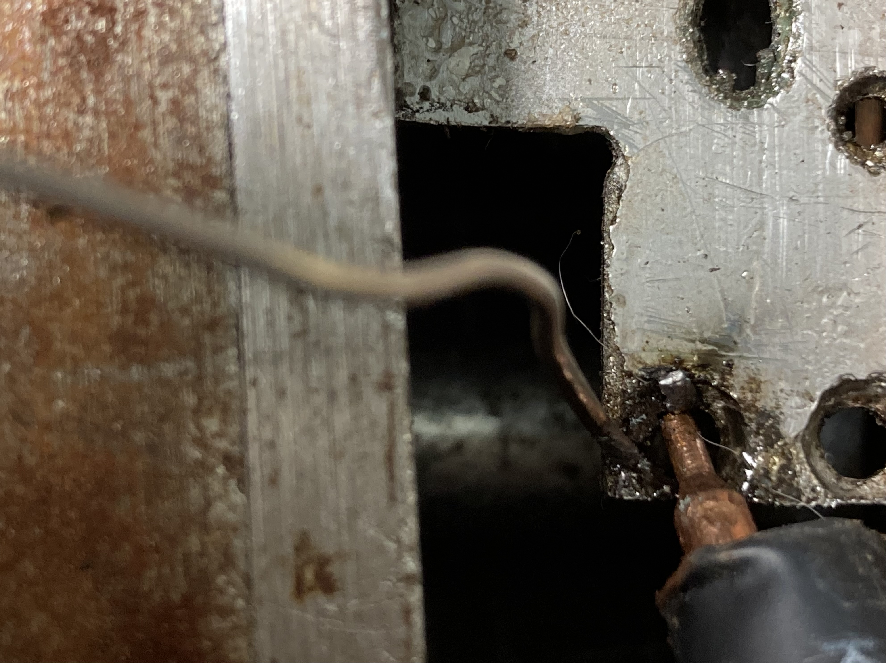

# Micropython-Based-SpotWelding

# 中文
其实我烧了两块MCU了，心情有点儿差。 （因为两次都是绝缘没做好） 
程序很简单，但是我有些bug还没来得及处理，因为MCU已经烧坏了，虽然串口芯片好像还没事儿
## 还没修复的bug
比如说脉冲时长可以被调成负数（但是实际上不可行），然后就是屏幕刷新问题，会显示一堆乱点
## 其他介绍：
这玩意儿是我尝试维修损坏的点焊机控制板时拿吃灰的开发板做的，原本的MCU是一块STC的芯片和两个寄存器，然后我用了一个ESP32的开发板代替，虽然一开始的MCU烧了，但是光耦和MOSFET还可以正常工作
# English
